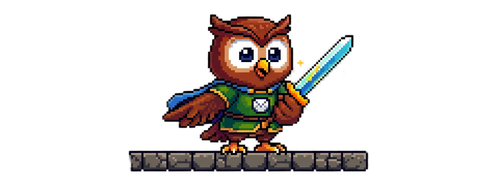
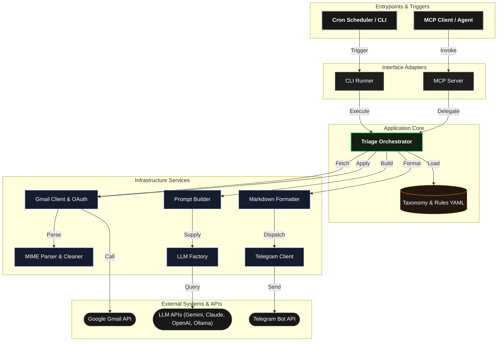

<div align="center">



![OpenAI](https://img.shields.io/badge/OpenAI-412991?logo=data%3Aimage%2Fsvg%2Bxml%3Bbase64%2CPHN2ZyB4bWxucz0iaHR0cDovL3d3dy53My5vcmcvMjAwMC9zdmciIHZpZXdCb3g9IjAgMCAyNCAyNCI%2BPHBhdGggZmlsbD0id2hpdGUiIGQ9Ik0yMi4yODIgOS44MjFhNS45ODUgNS45ODUgMCAwIDAtLjUxNi00LjkxIDYuMDQ2IDYuMDQ2IDAgMCAwLTYuNTEtMi45QTYuMDY1IDYuMDY1IDAgMCAwIDQuOTgxIDQuMThhNS45ODUgNS45ODUgMCAwIDAtMy45OTggMi45IDYuMDQ2IDYuMDQ2IDAgMCAwIC43NDMgNy4wOTcgNS45OCA1Ljk4IDAgMCAwIC41MSA0LjkxMSA2LjA1MSA2LjA1MSAwIDAgMCA2LjUxNSAyLjlBNS45ODUgNS45ODUgMCAwIDAgMTMuMjYgMjRhNi4wNTYgNi4wNTYgMCAwIDAgNS43NzItNC4yMDYgNS45OSA1Ljk5IDAgMCAwIDMuOTk3LTIuOSA2LjA1NiA2LjA1NiAwIDAgMC0uNzQ3LTcuMDczek0xMy4yNiAyMi40M2E0LjQ3NiA0LjQ3NiAwIDAgMS0yLjg3Ni0xLjA0bC4xNDEtLjA4MSA0Ljc3OS0yLjc1OGEuNzk1Ljc5NSAwIDAgMCAuMzkyLS42ODF2LTYuNzM3bDIuMDIgMS4xNjhhLjA3MS4wNzEgMCAwIDEgLjAzOC4wNTJ2NS41ODNhNC41MDQgNC41MDQgMCAwIDEtNC40OTQgNC40OTR6TTMuNiAxOC4zMDRhNC40NyA0LjQ3IDAgMCAxLS41MzUtMy4wMTRsLjE0Mi4wODUgNC43ODMgMi43NTlhLjc3MS43NzEgMCAwIDAgLjc4IDBsNS44NDMtMy4zNjl2Mi4zMzJhLjA4LjA4IDAgMCAxLS4wMzMuMDYyTDkuNzQgMTkuOTVhNC41IDQuNSAwIDAgMS02LjE0LTEuNjQ2ek0yLjM0IDguNTI4YTQuNDcxIDQuNDcxIDAgMCAxIDIuMzQ4LTEuOTcyVjEyLjFhLjc5Ljc5IDAgMCAwIC4zOTEuNjg3bDUuODQ0IDMuMzcyLTIuMDIgMS4xNjhhLjA3Ni4wNzYgMCAwIDEtLjA3MSAwbC00LjgzLTIuNzg2QTQuNTA0IDQuNTA0IDAgMCAxIDIuMzQgOC41Mjh6bTE2LjgyMiAzLjk0bC01Ljg0NS0zLjM3MiAyLjAyLTEuMTY4YS4wNzYuMDc2IDAgMCAxIC4wNzEgMGw0LjgzIDIuNzkxYTQuNDk0IDQuNDk0IDAgMCAxLS42NzYgOC4xMDV2LTUuNjc4YS43OS43OSAwIDAgMC0uNDA3LS42NzhoLjAwN3ptMi4wMS0zLjAyM2wtLjE0MS0uMDg1LTQuNzc0LTIuNzgyYS43NzYuNzc2IDAgMCAwLS43ODUgMEw5LjYzIDkuOTU3VjcuNjI1YS4wOC4wOCAwIDAgMSAuMDMzLS4wNjJsNC44NC0yLjc5NmE0LjUgNC41IDAgMCAxIDYuNjcgNC43ODR6bS0xMi42NCA0LjEzNWwtMi4wMi0xLjE2NGEuMDguMDggMCAwIDEtLjAzOC0uMDU3VjYuNzc1YTQuNSA0LjUgMCAwIDEgNy4zNzUtMy40NTNsLS4xNDIuMDgtNC43NzggMi43NThhLjc5NS43OTUgMCAwIDAtLjM5My42ODF2Ni43Mzd6bTEuMTAzLTIuMzk1bDIuNjctMS41NCAyLjY3IDEuNTR2My4wOGwtMi42NyAxLjU0LTIuNjctMS41NHoiLz48L3N2Zz4%3D)


*Autonomous email triage engine and agent skill.*

</div>

# 📝 **Description**

<div align="center">

***Inbox Sentinel*** is a production-grade **autonomous email triage engine** and **agent skill**.

It monitors your inbox, classifies all unclassified emails (both read and unread) using configurable LLM providers (**Ollama, OpenAI, Claude, or Gemini**), automatically synchronizes custom labels in Gmail, and delivers actionable Markdown digests to **Telegram**.

</div>

# 🏗️ **Architecture**

<div align="center">



</div>

# 📁 **Project Structure**

```text
inbox-sentinel/
├── package.json
├── tsconfig.json
├── .gitignore
├── .env.example                                        # Environment Variables
├── credentials.json.example
├── categories.yaml                                     # Categorization Taxonomy
├── README.md                                           # You are here! ⬅️
└── src/
    ├── index.ts                                        # Application Entrypoint
    ├── config/                                         # Environment Configuration
    │   └── env.ts
    ├── domain/                                         # Domain Models & Taxonomy
    │   ├── types.ts
    │   └── categories.ts
    ├── application/                                    # Core Orchestrator & Use Cases
    │   └── triage-orchestrator.ts
    ├── infrastructure/                                 # External Adapters
    │   ├── gmail/                                      # Gmail API & MIME Parser
    │   │   ├── gmail.client.ts
    │   │   └── mime.parser.ts
    │   ├── telegram/                                   # Telegram Transport & Formatter
    │   │   ├── telegram.client.ts
    │   │   └── telegram.formatter.ts
    │   └── llm/                                        # Universal LLM Factory & Providers
    │       ├── llm.interface.ts
    │       ├── prompt.builder.ts
    │       ├── llm.factory.ts
    │       └── providers/
    │           ├── gemini.provider.ts
    │           ├── anthropic.provider.ts
    │           └── openai-compat.provider.ts
    └── interfaces/                                     # Delivery Channels & Entrypoints
        ├── cli/                                        # CLI Runners & Auth Tool
        │   ├── index.ts
        │   └── auth.ts
        └── mcp/                                        # Model Context Protocol (MCP) Server
            ├── tool-definitions.ts
            └── server.ts
```

# 🔧 **Installation**

## 📋 Requirements

- **Node.js 20+** and **npm**
- **Google Cloud Platform** account (for Gmail API)
- **API Keys** for Telegram and chosen LLM providers

## ⚡ Quick Start

**1. Install dependencies**

```bash
npm install
```

**2. Set up the environment**

```bash
cp .env.example .env
```

Open `.env` and configure your settings:

- Using Gemini:

```env
AI_PROVIDER=gemini
GEMINI_API_KEY=your_gemini_api_key
TELEGRAM_BOT_TOKEN=your_bot_token
TELEGRAM_CHAT_ID=your_chat_id
```

- Using Ollama (Local):

```env
AI_PROVIDER=ollama
OLLAMA_BASE_URL=http://localhost:11434/v1
OLLAMA_MODEL=llama3.2:latest
TELEGRAM_BOT_TOKEN=your_bot_token
TELEGRAM_CHAT_ID=your_chat_id
```

**3. Configure Gmail credentials & OAuth authorization**

- Create a project in [Google Cloud Console](https://console.cloud.google.com/).
- Enable the **Gmail API**.
- Configure OAuth consent screen and create **OAuth 2.0 Client ID** (Application type: **Desktop app**).
- Under **OAuth consent screen**, set **Publishing status** to **"In production"** (click **"PUBLISH APP"**). *If left in "Testing", Google will expire refresh tokens every 7 days (`invalid_grant`).*
- Add `http://localhost:3000/oauth2callback` to authorized redirect URIs.
- Download the client credentials JSON and save it in the project root as `credentials.json`.
- Run the interactive authorization script:
  ```bash
  npm run auth
  ```
  *(This will generate and save `token.json` automatically).*

**4. Spin it up**

```bash
npm start
```

# 🚀 **Modes to Run**

## ⏰ Automated Cloud Crons

To run automated cloud crons completely free without a running server, use the ready-to-run GitHub Actions workflows:

- **Triager** ([triager.yml](.github/workflows/triager.yml)): Runs daily at **06:35** and **17:45** Madrid time.
- **Sweeper** ([sweeper.yml](.github/workflows/sweeper.yml)): Automatically purges emails under the *Misc* category every **Monday at 05:30 AM** Madrid time and sends a Telegram confirmation.

1. In your GitHub repository, go to **Settings** > **Secrets and variables** > **Actions**.
2. Add the following repository secrets:

```env
GEMINI_API_KEY=your_gemini_api_key
TELEGRAM_BOT_TOKEN=your_bot_token
TELEGRAM_CHAT_ID=your_chat_id
GMAIL_CREDENTIALS_JSON=your_credentials_json_content
GMAIL_TOKEN_JSON=your_token_json_content
```

> [!NOTE]
> You can also trigger manual runs anytime from the **Actions** tab on GitHub using the **Run workflow** button.

## 🤖 MCP Server Integration

To run it as an MCP server with any custom agent, add the following to your MCP configuration:

```json
{
  "mcpServers": {
    "inbox-sentinel": {
      "command": "npx",
      "args": [
        "tsx",
        "/absolute/path/to/inbox-sentinel/src/mcp.ts"
      ]
    }
  }
}
```

# 📚 **Tech Stack**

## 🗣️ Languages

- [TypeScript](https://www.typescriptlang.org/)

## 🧩 Frameworks & Libraries

- [Zod](https://zod.dev/)
- [Google APIs](https://github.com/googleapis/google-api-nodejs-client)
- [OpenAI Node SDK](https://github.com/openai/openai-node)
- [Anthropic TS SDK](https://github.com/anthropics/anthropic-sdk-typescript)
- [Google GenAI](https://github.com/google/generative-ai-js)
- [node-telegram-bot-api](https://github.com/yagop/node-telegram-bot-api)
- [dotenv](https://github.com/motdotla/dotenv)

## 🌐 External Services

- [Gmail API](https://developers.google.com/gmail/api)
- [Telegram Bot API](https://core.telegram.org/bots/api)

# 📄 **License**

This project is licensed under the MIT License - see the [LICENSE](LICENSE) file for details.

# 📞 **Get Help & Connect**

- 💬 [Start a discussion](https://github.com/cristiangilsanz/inbox-sentinel/discussions)
- 🐛 [Open an issue](https://github.com/cristiangilsanz/inbox-sentinel/issues)

<div align="center">
  <br>

  **Made with 💖 for the AI Community**

  ⭐ [Star this repo](https://github.com/cristiangilsanz/inbox-sentinel) · 🍴 [Fork it](https://github.com/cristiangilsanz/inbox-sentinel/fork)

  <br>

  [](https://www.buymeacoffee.com/)

</div>
